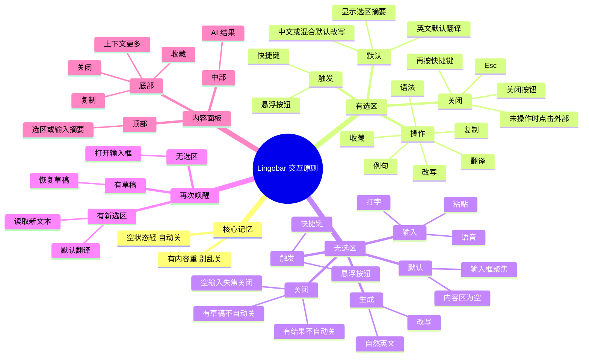
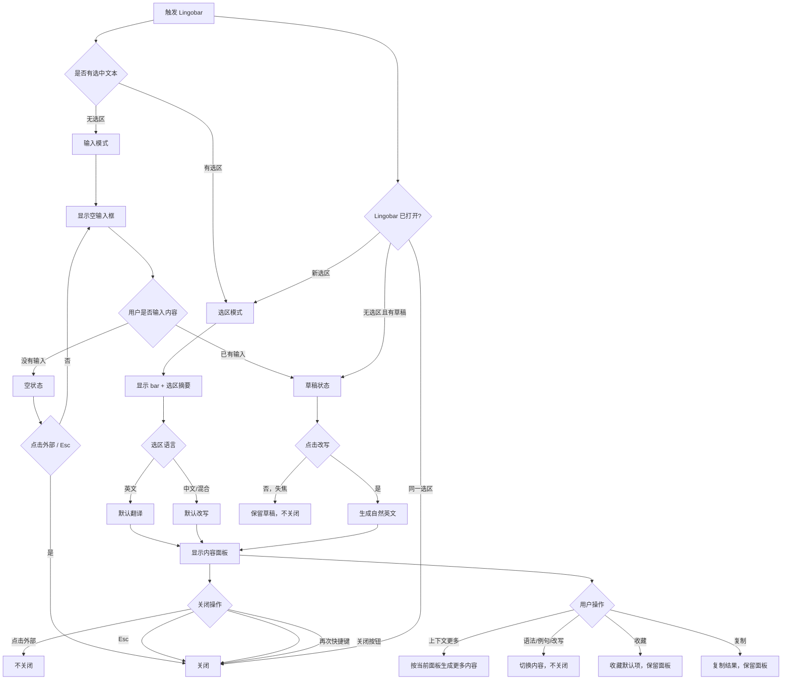

# Lingobar 交互细节指引

## 核心原则

**空状态轻，自动关；有内容重，别乱关。**

- 没有输入、没有结果、没有用户操作时，可以失焦关闭。
- 一旦用户输入了内容，或结果面板已经出现，就不要自动关闭。
- 关闭主要依赖 `Esc`、再次快捷键、关闭按钮。

一句话记忆：

**刚打开像菜单，出内容后像面板；空了可以关，有东西就别乱关。**

## 有选中文本时

触发方式：

- 用户选中文本。
- 按快捷键，或点击悬浮按钮。

打开状态：

- 在选区附近显示 Lingobar。
- 顶部 bar 展示选中文本摘要。
- 选中英文时，默认动作是 `翻译`。
- 选中中文或中英混合文本时，默认动作是 `改写`。
- 不显式展示语言判断标签，通过当前动作和结果标题表达意图。

用户动作：

- `翻译`：显示翻译结果。
- `语法`：显示语法拆解，只服务英文内容；中文/混合内容时保留位置但置灰。
- `改写`：把选中文本、中文、英文、中英混合或粗糙想法变成更自然的英文。
- `例句`：显示可模仿和迁移的新英文句子。
- `发音`：播放或展示发音信息。
- `收藏`：收藏当前内容板块的默认收藏项，显示收藏成功提示。
- `复制`：复制当前结果，显示复制成功提示。

关闭规则：

- 如果只是打开后未操作：点击外部关闭。
- 如果结果已经出现：点击外部不关闭。
- 按 `Esc`：关闭。
- 再按一次快捷键：关闭。
- 点关闭按钮：关闭。

重新触发：

- 如果用户选择了新文本并触发：用新文本替换旧内容，重新默认翻译。
- 如果同一选区再次触发：关闭当前 Lingobar。

## 无选中文本时

触发方式：

- 用户没有选中文本。
- 按快捷键，或点击悬浮按钮。

打开状态：

- 显示 Lingobar 输入状态。
- 输入框获得焦点。
- 内容区为空。
- 可输入中文、英文、中英混合、粗糙想法，或语音输入。
- MVP 输入模式只服务 `改写 / 自然英文表达`，不做开放式 Ask AI。

用户动作：

- 输入文字：进入草稿状态。
- 点击 `改写`：生成自然英文表达。
- 可选方向：更口语、更正式、更简单、更地道。
- 点击 `语音`：开始语音输入，识别文本进入输入框。

关闭规则：

- 输入框为空时：点击外部关闭。
- 输入框为空时：按 `Esc` 关闭。
- 已输入文字但未生成结果：点击外部不关闭，保留草稿。
- 已生成结果：点击外部不关闭。
- 按 `Esc`：关闭。
- 再按一次快捷键：关闭。
- 点关闭按钮：关闭。

重新触发：

- 如果无选区再次触发，并且有未完成草稿：恢复草稿。
- 如果无选区再次触发，没有草稿：打开空输入框。
- 如果此时用户选中了文本再触发：切换到选区模式，输入草稿可临时保留。

## 内容面板状态

进入条件：

- 默认翻译完成。
- 用户点击任一动作。
- 用户输入后点击改写。

面板结构：

- 顶部：当前输入/选区摘要 + 靠右紧凑动作区。
- 中部：结果内容。
- 底部：后续操作按钮。

尺寸与滚动：

- Lingobar 浮窗宽度固定，不因语法、例句、改写等内容切换而变化。
- 顶部的选区摘要/输入框是主区域，优先占用横向空间。
- 右侧语言动作使用紧凑图标按钮，完整名称放在 tooltip / accessibility label 中。
- 浮窗有最大高度；内容超出时在结果区出现纵向滚动条。
- 底部按钮区保持可见，不被长内容推到屏幕外。
- 顶部动作区靠右排列，保留 `固定窗口` 和 `关闭` 两个图标按钮。

底部按钮：

- `复制`：复制当前结果。
- `收藏`：收藏当前内容板块的默认收藏项。
- `[上下文更多]`：根据当前面板变化，不使用泛泛的 `继续展开`。
  例如：翻译用 `解释更多`，语法用 `继续拆解`，改写用 `更多版本`，例句用 `更多例句`，发音用 `慢速播放`。
- `关闭`：关闭 Lingobar。

第一版不把 `插入当前 App` 作为主按钮；写回当前 App 先通过 `复制` 完成。

面板行为：

- 点击不同动作时，内容区切换，不关闭面板。
- 点击外部不关闭。
- 结果生成中显示 loading。
- 出错时显示错误状态，并允许重试。

## Esc 行为

第一版建议保持简单：

- 空输入框：`Esc` 关闭。
- 有选区结果：`Esc` 关闭。
- 有草稿：`Esc` 关闭，但保存草稿。
- 生成中：`Esc` 取消生成并关闭。
- 已 pin / 固定：`Esc` 只取消焦点，不关闭，需手动关闭。

如果后续需要更细：

- 第一次 `Esc`：关闭当前面板。
- 如果已经只剩 bar，再按 `Esc`：关闭 Lingobar。

## 再按快捷键

- Lingobar 关闭时：打开。
- Lingobar 已打开，且当前选区没变：关闭。
- Lingobar 已打开，但用户选了新文本：切换到新文本并默认翻译。
- Lingobar 已打开，且无选区：聚焦输入框。
- Lingobar 已打开，输入框已有草稿：保持草稿并聚焦。

## 点击外部

点击外部关闭的情况：

- 无选区输入框为空。
- 刚打开，还没有结果或用户操作。
- 只是临时 bar 状态。

点击外部不关闭的情况：

- 输入框已有文字。
- 结果已经生成。
- 用户已经点击过语法、例句、改写等动作。
- 正在生成结果。
- 面板被 pin / 固定。

## 草稿规则

- 用户在无选区模式输入文字后，自动保存为临时草稿。
- 失焦不删除草稿。
- 再次无选区唤醒时恢复草稿。
- 用户手动关闭后，可以清空草稿，或保留最近一次草稿。
- 建议第一版：手动关闭清空草稿，失焦保留草稿。

## 选区变化规则

- 如果 Lingobar 打开期间选区变化：不自动刷新，避免打扰。
- 用户再次按快捷键时，读取新选区并刷新。
- 如果选区消失：已有结果不受影响。
- 再次触发且无选区时，进入无选区输入模式。

## 推荐第一版规则

```text
有选区触发
→ 打开 Lingobar
→ 英文默认翻译；中文/混合默认改写
→ 点击动作切换内容
→ 点击外部不关闭
→ Esc / 快捷键 / 关闭按钮关闭

无选区触发
→ 打开输入框
→ 空输入框点击外部关闭
→ 有输入则保留
→ 点击改写后显示自然英文
→ Esc / 快捷键 / 关闭按钮关闭
```

## 记忆脑图



## 开发流程图


